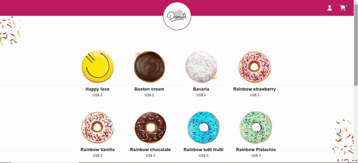

<a id="readme-top"></a>
<br />

<div align="center">
  <a href="https://github.com/othneildrew/Best-README-Template">
    
  </a>

  <h3 align="center">Donut Shop in VUE</h3>
   <a href="https://project-jmnhkxgaq-diaslucia.vercel.app/">View Demo</a>
   <br/>
</div>

<p align="center">
  
</p>

## 🔎 About

This website was developed using Vue 

It serves as an e-commerce platform, offering user registration and login functionalities. Customers can register and log in to purchase delicious donuts and access their order history. On the other hand, administrators have special access rights, enabling them to add, delete, or modify products, as well as view all client orders..

## 🚀 Ejecution

Steps to install and run the project:

1. Clone the project
   ```sh
   git clone https://github.com/diaslucia/project-vue
   ```
2. Open your current directory project
   ```sh
   cd project-vue
   ```
3. Install the libraries
   ```sh
   npm install
   ```
4. Create an `.env` file to enter your MockApi URL
   ```js
   VUE_APP_MOCKAPI_URL = url;
   ```
5. Ejecute the app (and close it with Ctrl + C)

   ```sh
   npm run serve
   ```

## 📂 Structure

The structure of the files is:

- assets: to store images.
- components: to store all componentes.
- services: to store fetch helper.
- utils: to store helpers.
- views: to store pages structure components.

## 🛠 Libraries

**[Vue Form](https://vueform.com/)**: to validate forms.

**[Vue Router](https://router.vuejs.org/)**: to manage navigations and pages.

**[Vuex](https://vuex.vuejs.org/)**: to manage global states.

<p align="right">(<a href="#readme-top">to Top</a>)</p>
